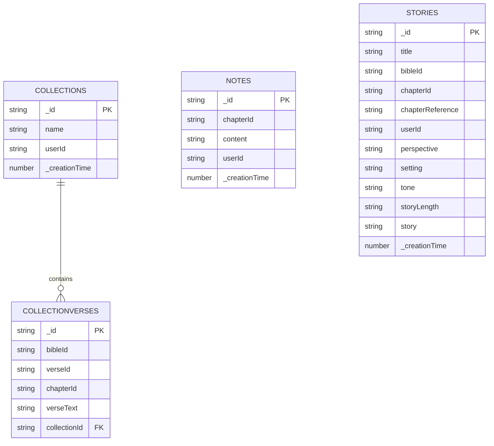

## Overview

Your Bible uses Convex as its real-time database backend for storing user-generated content: collections, verses, notes, and AI-generated stories. The schema is defined in `convex/schema.ts` and provides automatic type generation and real-time synchronization.

<Info>
  Convex automatically generates TypeScript types from the schema, ensuring type safety across your application.
</Info>

## Schema Definition

The complete schema as defined in `convex/schema.ts`:

```typescript
import { defineSchema, defineTable } from "convex/server";
import { v } from "convex/values";

export default defineSchema({
  collections: defineTable({
    name: v.string(),
    userId: v.string(),
  }),
  collectionVerses: defineTable({
    bibleId: v.string(),
    verseId: v.string(),
    chapterId: v.string(),
    verseText: v.string(),
    collectionId: v.id("collections"),
  }).index("by_collection_id", ["collectionId"]),
  notes: defineTable({
    chapterId: v.string(),
    content: v.string(),
    userId: v.string(),
  }).index("by_chapter_id", ["chapterId"]),
  stories: defineTable({
    title: v.string(),
    bibleId: v.string(),
    chapterId: v.string(),
    chapterReference: v.string(),
    userId: v.string(),
    perspective: v.string(),
    setting: v.string(),
    tone: v.string(),
    storyLength: v.string(),
    story: v.string(),
  }).index("by_user_id", ["userId"]),
});
```

## Tables

### collections

<Info>
  User-created collections for organizing favorite Bible verses.
</Info>

**Purpose:** Store collection metadata (name, owner)

**Fields:**

<ParamField path="_id" type="Id<'collections'>">
  Auto-generated unique identifier for the collection.
  
  **Type:** Convex ID
  
  **Generated:** Automatically by Convex
  
  **Example:** `k17abc123def456`
</ParamField>

<ParamField path="name" type="string" required>
  Display name of the collection.
  
  **Example:** `"Favorite Psalms"`, `"Comfort Verses"`, `"Daily Reading"`
  
  **Constraints:** 
  - Minimum 1 character
  - Maximum 100 characters (enforced by app, not schema)
  
  **Validation:** See `src/schemas/collection-schema.ts`
</ParamField>

<ParamField path="userId" type="string" required>
  ID of the user who owns this collection.
  
  **Source:** Better Auth user ID
  
  **Purpose:** Ensures users only see their own collections
  
  **Example:** `"user_abc123"`
</ParamField>

<ParamField path="_creationTime" type="number">
  Timestamp when the collection was created.
  
  **Type:** Unix timestamp (milliseconds)
  
  **Generated:** Automatically by Convex
  
  **Example:** `1709481234567`
</ParamField>

**Indexes:** None (small table, queries by userId are fast)

**Relationships:**
- One-to-many with `collectionVerses` (one collection has many verses)

**Usage Example:**

```typescript
// Create a collection
const collectionId = await ctx.runMutation(api.collections.create, {
  name: "My Favorites",
  userId: currentUser.id,
});

// Query user's collections
const myCollections = await ctx.runQuery(api.collections.list, {
  userId: currentUser.id,
});
```

### collectionVerses

<Info>
  Individual verses stored within collections. Links Bible verses to collections.
</Info>

**Purpose:** Store verses added to collections with full metadata

**Fields:**

<ParamField path="_id" type="Id<'collectionVerses'>">
  Auto-generated unique identifier for the verse entry.
  
  **Generated:** Automatically by Convex
</ParamField>

<ParamField path="bibleId" type="string" required>
  ID of the Bible translation this verse belongs to.
  
  **Source:** API.Bible translation ID
  
  **Example:** `"de4e12af7f28f599-02"` (KJV), `"592420522e16049f-01"` (ASV)
  
  **Purpose:** Allows verses from different translations
</ParamField>

<ParamField path="verseId" type="string" required>
  Unique identifier for the specific verse.
  
  **Source:** API.Bible verse ID
  
  **Format:** `{bookId}.{chapterId}.{verseNumber}`
  
  **Example:** `"GEN.1.1"`, `"PSA.23.1"`, `"JHN.3.16"`
</ParamField>

<ParamField path="chapterId" type="string" required>
  ID of the chapter containing this verse.
  
  **Source:** API.Bible chapter ID
  
  **Format:** `{bookId}.{chapterNumber}`
  
  **Example:** `"GEN.1"`, `"PSA.23"`, `"JHN.3"`
  
  **Purpose:** Enable navigation to full chapter context
</ParamField>

<ParamField path="verseText" type="string" required>
  The actual text content of the verse.
  
  **Source:** API.Bible verse content
  
  **Example:** `"In the beginning God created the heaven and the earth."`
  
  **Purpose:** Display verse without additional API calls
</ParamField>

<ParamField path="collectionId" type="Id<'collections'>" required>
  Reference to the parent collection.
  
  **Type:** Foreign key to `collections` table
  
  **Purpose:** Links verse to its collection
</ParamField>

**Indexes:**

<ParamField path="by_collection_id" type="index">
  Index on `collectionId` field for efficient verse queries.
  
  **Purpose:** Quickly retrieve all verses in a collection
  
  **Query pattern:** `ctx.db.query("collectionVerses").withIndex("by_collection_id", q => q.eq("collectionId", id))`
</ParamField>

**Relationships:**
- Many-to-one with `collections` (many verses belong to one collection)

**Usage Example:**

```typescript
// Add verse to collection
await ctx.runMutation(api.collectionVerses.add, {
  collectionId: collection._id,
  bibleId: "de4e12af7f28f599-02",
  verseId: "JHN.3.16",
  chapterId: "JHN.3",
  verseText: "For God so loved the world...",
});

// Get all verses in a collection
const verses = await ctx.runQuery(api.collectionVerses.list, {
  collectionId: collection._id,
});
```

### notes

<Info>
  User's personal notes for Bible chapters with rich text formatting.
</Info>

**Purpose:** Store chapter-specific notes with rich text content

**Fields:**

<ParamField path="_id" type="Id<'notes'>">
  Auto-generated unique identifier for the note.
</ParamField>

<ParamField path="chapterId" type="string" required>
  ID of the Bible chapter this note is about.
  
  **Source:** API.Bible chapter ID
  
  **Format:** `{bookId}.{chapterNumber}`
  
  **Example:** `"GEN.1"`, `"MAT.5"`, `"REV.22"`
  
  **Uniqueness:** One note per chapter per user (enforced by app logic)
</ParamField>

<ParamField path="content" type="string" required>
  Rich text content of the note.
  
  **Format:** JSON string from Plate.js editor
  
  **Example:**
  ```json
  [
    {"type": "h3", "children": [{"text": "My Thoughts"}]},
    {"type": "p", "children": [{"text": "This chapter shows..."}]}
  ]
  ```
  
  **Editor:** Plate.js rich text editor
  
  **Features:** Bold, italic, headings, lists, quotes, etc.
</ParamField>

<ParamField path="userId" type="string" required>
  ID of the user who owns this note.
  
  **Purpose:** Ensures notes are private to each user
</ParamField>

**Indexes:**

<ParamField path="by_chapter_id" type="index">
  Index on `chapterId` field for efficient note retrieval.
  
  **Purpose:** Quickly find note for current chapter
  
  **Query pattern:** `ctx.db.query("notes").withIndex("by_chapter_id", q => q.eq("chapterId", id))`
</ParamField>

**Relationships:**
- Independent table (references Bible chapters via ID string)

**Usage Example:**

```typescript
// Create or update note
await ctx.runMutation(api.notes.upsert, {
  chapterId: "GEN.1",
  content: JSON.stringify(editorContent),
  userId: currentUser.id,
});

// Get note for chapter
const note = await ctx.runQuery(api.notes.get, {
  chapterId: "GEN.1",
  userId: currentUser.id,
});
```

### stories

<Info>
  AI-generated stories based on Bible passages with customizable parameters.
</Info>

**Purpose:** Store AI-generated stories with generation parameters and metadata

**Fields:**

<ParamField path="_id" type="Id<'stories'>">
  Auto-generated unique identifier for the story.
</ParamField>

<ParamField path="title" type="string" required>
  User-provided title for the story.
  
  **Example:** `"Creation from Adam's Perspective"`, `"A Journey Through the Red Sea"`
  
  **Constraints:** Minimum 1 character, maximum 200 characters
</ParamField>

<ParamField path="bibleId" type="string" required>
  ID of the Bible translation used as source.
  
  **Source:** API.Bible translation ID
  
  **Purpose:** Link story to original biblical text
</ParamField>

<ParamField path="chapterId" type="string" required>
  ID of the chapter the story is based on.
  
  **Format:** `{bookId}.{chapterNumber}`
  
  **Example:** `"GEN.1"`, `"EXO.14"`
</ParamField>

<ParamField path="chapterReference" type="string" required>
  Human-readable chapter reference.
  
  **Example:** `"Genesis 1"`, `"Exodus 14"`, `"Psalm 23"`
  
  **Purpose:** Display-friendly reference
</ParamField>

<ParamField path="userId" type="string" required>
  ID of the user who generated this story.
  
  **Purpose:** Show user's own stories, enforce rate limits
</ParamField>

<ParamField path="perspective" type="string" required>
  Narrative perspective for the story.
  
  **Examples:** `"first-person"`, `"third-person observer"`, `"from Mary's perspective"`
  
  **Usage:** Passed to AI for story generation
</ParamField>

<ParamField path="setting" type="string" required>
  Setting or context for the story.
  
  **Examples:** `"ancient Israel"`, `"modern day"`, `"fantasy world"`
  
  **Usage:** Influences AI story generation
</ParamField>

<ParamField path="tone" type="string" required>
  Emotional tone of the story.
  
  **Examples:** `"contemplative"`, `"adventurous"`, `"solemn"`, `"joyful"`
  
  **Usage:** Guides AI's writing style
</ParamField>

<ParamField path="storyLength" type="string" required>
  Desired length of the generated story.
  
  **Options:** `"short"`, `"medium"`, `"long"`
  
  **Approximate lengths:**
  - Short: 200-400 words
  - Medium: 400-800 words
  - Long: 800-1500 words
</ParamField>

<ParamField path="story" type="string" required>
  The AI-generated story content.
  
  **Format:** Plain text or markdown
  
  **Source:** Google Gemini AI response
  
  **Length:** Varies based on `storyLength` parameter
</ParamField>

**Indexes:**

<ParamField path="by_user_id" type="index">
  Index on `userId` field for efficient user story queries.
  
  **Purpose:** List all stories created by a user
  
  **Query pattern:** `ctx.db.query("stories").withIndex("by_user_id", q => q.eq("userId", id))`
</ParamField>

**Relationships:**
- Independent table (references Bible chapters and users via ID strings)

**Usage Example:**

```typescript
// Create story
const storyId = await ctx.runMutation(api.stories.create, {
  title: "Creation Story",
  bibleId: "de4e12af7f28f599-02",
  chapterId: "GEN.1",
  chapterReference: "Genesis 1",
  userId: currentUser.id,
  perspective: "first-person from God's perspective",
  setting: "the beginning of time",
  tone: "majestic and powerful",
  storyLength: "medium",
  story: generatedStoryText,
});

// Get user's stories
const myStories = await ctx.runQuery(api.stories.list, {
  userId: currentUser.id,
});
```

## Relationships Diagram



## Indexes and Performance

### Why Indexes Matter

Indexes dramatically improve query performance for common access patterns:

<CardGroup cols={2}>
  <Card title="by_collection_id" icon="magnifying-glass">
    **Table:** collectionVerses
    
    **Purpose:** Efficiently query all verses in a collection
    
    **Without index:** O(n) - scans all verses
    
    **With index:** O(log n) - fast lookup
  </Card>
  
  <Card title="by_chapter_id" icon="book">
    **Table:** notes
    
    **Purpose:** Quickly find note for current chapter
    
    **Benefit:** Instant note loading when viewing chapters
  </Card>
  
  <Card title="by_user_id" icon="user">
    **Table:** stories
    
    **Purpose:** List all stories for a user
    
    **Benefit:** Fast story dashboard loading
  </Card>
</CardGroup>

### Query Patterns

<CodeGroup>
```typescript Get Collection Verses
// Efficient: Uses by_collection_id index
const verses = await ctx.db
  .query("collectionVerses")
  .withIndex("by_collection_id", (q) =>
    q.eq("collectionId", collectionId)
  )
  .collect();
```

```typescript Get Chapter Note
// Efficient: Uses by_chapter_id index
const note = await ctx.db
  .query("notes")
  .withIndex("by_chapter_id", (q) =>
    q.eq("chapterId", chapterId)
  )
  .filter((q) => q.eq(q.field("userId"), userId))
  .first();
```

```typescript Get User Stories
// Efficient: Uses by_user_id index
const stories = await ctx.db
  .query("stories")
  .withIndex("by_user_id", (q) =>
    q.eq("userId", userId)
  )
  .order("desc")
  .collect();
```
</CodeGroup>

## Schema Migrations

<Info>
  Convex handles schema migrations automatically. Changes are applied when you save the schema file.
</Info>

### Adding a New Field

<Steps>
  <Step title="Update Schema">
    Edit `convex/schema.ts` to add the new field:
    
    ```typescript
    collections: defineTable({
      name: v.string(),
      userId: v.string(),
      description: v.optional(v.string()), // New field
    }),
    ```
  </Step>
  
  <Step title="Save and Deploy">
    Convex automatically detects the change and updates the schema.
    
    ```bash
    # If running npx convex dev, it auto-deploys
    # Otherwise:
    npx convex deploy
    ```
  </Step>
  
  <Step title="Update Types">
    Convex regenerates TypeScript types automatically. Import updated types:
    
    ```typescript
    import { Doc } from "convex/_generated/dataModel";
    
    type Collection = Doc<"collections">;
    // Now includes optional 'description' field
    ```
  </Step>
  
  <Step title="Handle Existing Data">
    Existing documents won't have the new field. Use optional fields or provide defaults:
    
    ```typescript
    const description = collection.description ?? "No description";
    ```
  </Step>
</Steps>

### Adding an Index

```typescript
// Add index to schema
collections: defineTable({
  name: v.string(),
  userId: v.string(),
})
.index("by_user_id", ["userId"]), // New index

// Use in queries
const userCollections = await ctx.db
  .query("collections")
  .withIndex("by_user_id", (q) => q.eq("userId", userId))
  .collect();
```

### Removing a Field

<Warning>
  Be careful when removing fields. Ensure no code references the field before removal.
</Warning>

<Steps>
  <Step title="Update All Code">
    Remove all references to the field from your codebase.
  </Step>
  
  <Step title="Update Schema">
    Remove the field from the schema definition.
  </Step>
  
  <Step title="Deploy Changes">
    Convex will ignore the field in existing documents, but won't delete the data.
  </Step>
  
  <Step title="Clean Up Data (Optional)">
    Write a migration script to remove the field from existing documents if needed.
  </Step>
</Steps>

## Best Practices

<AccordionGroup>
  <Accordion title="Use Indexes for Common Queries">
    Add indexes for fields you frequently query:
    
    ```typescript
    // Good: Index on commonly queried field
    .index("by_user_id", ["userId"])
    
    // Consider: Compound indexes for complex queries
    .index("by_user_and_date", ["userId", "_creationTime"])
    ```
  </Accordion>
  
  <Accordion title="Keep Documents Small">
    - Store large text in separate documents or external storage
    - Current design is good: story content is reasonable size
    - Avoid storing binary data directly in Convex
  </Accordion>
  
  <Accordion title="Use Optional Fields for Flexibility">
    ```typescript
    // Good: Optional field for future features
    tags: v.optional(v.array(v.string())),
    
    // Can add later without breaking existing documents
    ```
  </Accordion>
  
  <Accordion title="Validate Data in Mutations">
    ```typescript
    // Validate before inserting
export const create = mutation({
      args: {
        name: v.string(),
        userId: v.string(),
      },
      handler: async (ctx, args) => {
        if (args.name.length < 1 || args.name.length > 100) {
          throw new Error("Invalid name length");
        }
        return await ctx.db.insert("collections", args);
      },
    });
    ```
  </Accordion>
  
  <Accordion title="Use Consistent ID Formats">
    - API.Bible IDs: Store as-is (e.g., `"GEN.1.1"`)
    - User IDs: Store from Better Auth (e.g., `"user_abc123"`)
    - Convex IDs: Use generated IDs (e.g., `Id<"collections">`)
  </Accordion>
</AccordionGroup>

## Data Access Patterns

### Reading Data

<CodeGroup>
```typescript Query (Real-time)
// Queries are reactive - updates automatically
const collections = useQuery(api.collections.list, {
  userId: user.id,
});

// Re-renders when data changes
```

```typescript Mutation (Write)
// Mutations modify data
const createCollection = useMutation(api.collections.create);

await createCollection({
  name: "New Collection",
  userId: user.id,
});
```

```typescript Server Action
// From TanStack Start server action
import { api } from "convex/_generated/api";
import { convex } from "@/lib/convex";

const stories = await convex.query(api.stories.list, {
  userId: user.id,
});
```
</CodeGroup>

### Pagination

```typescript
// Paginate large datasets
export const listPaginated = query({
  args: {
    userId: v.string(),
    paginationOpts: paginationOptsValidator,
  },
  handler: async (ctx, args) => {
    return await ctx.db
      .query("stories")
      .withIndex("by_user_id", (q) => q.eq("userId", args.userId))
      .order("desc")
      .paginate(args.paginationOpts);
  },
});
```

## Security Considerations

<Warning>
  Always validate user access in Convex functions. The schema doesn't enforce permissions.
</Warning>

### Access Control Example

```typescript
// Validate user can access collection
export const get = query({
  args: { id: v.id("collections"), userId: v.string() },
  handler: async (ctx, args) => {
    const collection = await ctx.db.get(args.id);
    
    if (!collection) {
      throw new Error("Collection not found");
    }
    
    if (collection.userId !== args.userId) {
      throw new Error("Unauthorized");
    }
    
    return collection;
  },
});
```

## Related Documentation

<CardGroup cols={2}>
  <Card title="Convex Documentation" icon="book" href="https://docs.convex.dev/">
    Official Convex documentation and guides
  </Card>
  
  <Card title="Project Structure" icon="folder-tree" href="/development/project-structure">
    How Convex integrates with the project
  </Card>
  
  <Card title="Integrations" icon="plug" href="/development/integrations">
    Convex integration details
  </Card>
  
  <Card title="API Reference" icon="code" href="/api-reference/convex">
    API documentation for Convex functions
  </Card>
</CardGroup>
